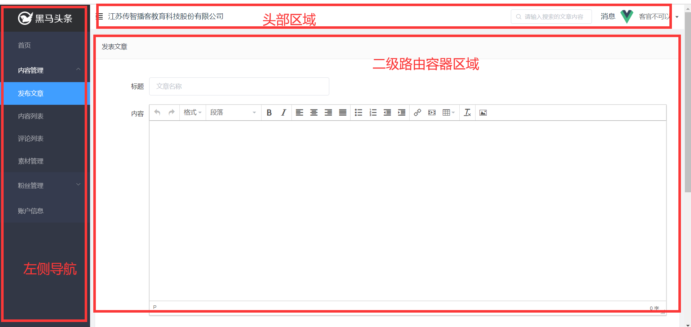

## 黑马头条PC-主页模块-页面布局

**`思路-步骤`** 实现以下布局



* elementUI组件 是否有支持类似效果的

* el-container => 大容器

* 左侧 =>  el-aside 

* 右侧 => el-container =>  el-header- el-main

* ```xml
  <!-- 先在最外层放置一个大容器 因为 小容器只能放到大容器里面 -->
     <el-container>
       <el-aside>
         <h1>左侧导航区域</h1>
       </el-aside>
       <!-- 右侧 再嵌套一个 el-container -->
       <el-container>
         <!-- 再上下布局 -->
         <el-header>
           <h1>顶部操作栏</h1>
         </el-header>
         <!-- 主要区域 -->
         <el-main>
           <h1>主要区域</h1>
            <!-- 这里应该放置 二级路由容器 -->
           <router-view></router-view>
       </el-main>
       </el-container>
     </el-container>
  ```
  
  

## 黑马头条PC-主页模块-左侧导航菜单

**`思路-步骤`**

左侧菜单背景色   **`#323745`** 菜单图片背景色  **`#2e2f32`**导航背景色 **`#353b4e`**导航字体颜色 **`#adafb5`**

> 首先确定 左侧导航菜单的技术方案,我们采用elementUI组件 **`el-menu`**

我们应该 单独封装一个左侧导航组件,然后在主页中使用, 接下来封装一个普通组件**`layout-aside`**

普通组件  一般放置在 components目录下

路由组件 一般放在  views(pages)目录下

> 在components 下的home文件夹里面 新建一个 layout-aside.vue, 在主页中引用,注册 并使用

接下来,就要实现左侧导航的结构

```vue
<template>
  <div class='layout-aside'>
     <!-- 头部图片 -->
     <div class='title'>
         
     </div>
     <!-- 导航菜单 -->
     <el-menu background-color="#323745" text-color="#adafb5">
         <!-- 子菜单 没有子菜单的 用 el-menu-item标签 -->
         <el-menu-item>
             <i class='el-icon-s-home'></i>
             <span>首页</span>
         </el-menu-item>
         <!-- 二级菜单 需要用submenu -->
         <el-submenu>
             <template slot="title">
                <i  class='el-icon-s-grid'></i>
                <span >内容管理</span>
             </template>
             <!-- 匿名插槽是二级菜单  具名插槽title是一级菜单-->
             <!-- 二级菜单项 还是使用el-menu-item -->
             <el-menu-item>发布文章</el-menu-item>
             <el-menu-item>内容列表</el-menu-item>
             <el-menu-item>评论列表</el-menu-item>
             <el-menu-item>素材管理</el-menu-item>

         </el-submenu>
           <el-submenu>
               <template slot="title">
                 <i class='el-icon-s-opportunity'></i>
                 <span>粉丝管理</span>
               </template>
             <!-- 二级菜单项 还是使用el-menu-item -->
             <el-menu-item>图文数据</el-menu-item>
             <el-menu-item>粉丝概况</el-menu-item>
             <el-menu-item>粉丝画像</el-menu-item>
             <el-menu-item>粉丝列表</el-menu-item>

         </el-submenu>
         <el-menu-item>
             <i class="el-icon-user-solid"></i>
             <span>账户信息</span>
         </el-menu-item>
     </el-menu>
  </div>
</template>

<script>
export default {

}
</script>

<style lang='less' scoped>
  .layout-aside {
      background-color: #2e2f32;
      width:230px;
      height: 100vh;
      .title {
          text-align: center;
          padding: 10px 0;
          img {
              height: 35px;
          }
      }
      .el-menu {
          border-right: none;
      }
  }
</style>

```

el-menu 导航菜单

el-menu-item 子菜单

el-submenu  折叠菜单

## 黑马头条PC-主页模块-头部结构及下拉菜单

**`思路-步骤`**

> 开发头部结构,顶部操作栏, 同样新建一个普通组件 layout-header组件, 同样在home文件下

在主页组件中 引入,注册 并且使用 layout-header组件

> 接下来 实现 顶部操作栏的页面结构

```vue
<template>
  <!-- elementUI布局组件 el-row 和 el-col -->
  <el-row align="middle" type='flex' class='layout-header'>
      <!-- 等分为两列  为什么是:span="12"-->
    <el-col class='left' :span="12">
       <!-- 图标 -->
       <i class='el-icon-s-fold'></i>
       <span>
           江苏传智播客教育科技股份有限公司
       </span>
    </el-col>
    <!-- 右侧列 -->
    <el-col class='right' :span="12">
        <!-- 再次放置一个 row组件  align属性设置垂直对齐方式  justify设置 水平对齐属性-->
        <el-row type='flex' justify="end" align="middle">
          
           <!-- 下拉菜单 -->
           <el-dropdown trigger='click'>
               <!-- 显示的内容 -->
               <span>水若寒宇</span>
                <!-- 下拉内容需要做具名插槽dropdown  el-dropdown-menu是专门做下拉的组件 -->
                <el-dropdown-menu slot="dropdown" >
                   <!-- 下拉选项 el-dropdown-item 作为下拉选项组件-->
                    <el-dropdown-item>个人信息</el-dropdown-item>
                    <el-dropdown-item>git地址</el-dropdown-item>
                    <el-dropdown-item>退出</el-dropdown-item>

                </el-dropdown-menu>
           </el-dropdown>
        </el-row>
    </el-col>
  </el-row>
</template>

<script>
export default {

}
</script>

<style lang='less' scoped>
  .layout-header {
      height: 60px;
      .left {
          i {
              font-size:20px;
          }
      }
      .right {
          img {
              width: 40px;
              height: 40px;
              border-radius: 50%;
              margin-right: 4px;
          }
      }
  }
</style>

```


## 黑马头条PC-统一全局注册插件的使用方式Vue.use

**`思路-步骤`**

> Vue.use 是全局注册的方式 会调用 对象中的一个**`install`**方法,并且传入 Vue对象作为参数

我们需要把目前的组件引入注册形式 改成 Vue.use 的形式

> 首先我们需要一个公共的注册的js文件, 这个文件负责 注册我们自己开发的所有的组件

在components文件夹下 新建一个**`index.js`**文件,作为公共的注册文件

> 这个文件要完成所有的组件的注册 , 全局注册

```js

// 需要使用Vue.use的方式去注册
// Vue.use会调用对象中的install方法 install方法第一个参数 是Vue对象
import LayoutHeader from './home/layout-header'
import LayoutAside from './home/layout-aside'

export default {
  install: function (Vue) {
    //   注册全局组件 Vue 一旦注册 在任意位置都可以使用
    Vue.component('layout-header', LayoutHeader) // 注册头部组件
    Vue.component('layout-aside', LayoutAside) // 注册左侧导航组件
  }
}
```

> 以上这种方式, 可以直接用Vue.use全局注册我们使用的组件,就不需要再一次次的引入 注册了

## 黑马头条PC-主页模块-头部信息查询

**`思路-步骤`**

> 我们需要 获取用户的个人信息 显示在头部信息栏区域

此时需要调用api接口

> 应该在 组件实例化之后就调用接口, 应该在**`created`** 获取用户的个人资料

应该在data中定义一个对象来接收数据

```js
  data () {
    return {
      userInfo: {} // 用户个人信息
    }
  },
```

> 在 钩子函数 created中 获取用户资料,注意需要 **`取钥匙`**, 将token放入到 headers中,

```js
  created () {
    const token = localStorage.getItem('user-token') // 从兜里拿钥匙 也就是从缓存中取token
    //   获取用户的个人信息
    this.$axios({
      url: '/user/profile', // 请求地址
      headers: {
        Authorization: `Bearer ${token}` // 格式要求 Bearer +token
      } // 请求头参数 headers放置请求头参数
    }).then(result => {
      // 如果加载成功了 我们要将数据赋值给 userInfo
      this.userInfo = result.data.data
    })
  }
```

> 将数据 使用 v-bind绑定给页面结构

## 黑马头条PC-主页模块-头部退出系统

**`思路-步骤`**

## 黑马头条PC-主页模块-左侧导航配置路由

**`思路-步骤`**

## 黑马头条PC-主页模块-默认导航

**`思路-步骤`**

## 黑马头条PC-登录模块-主页-权限思考

**`思路-步骤`**  

## 黑马头条PC-主页模块-导航守卫

**`思路-步骤`**

## 黑马头条PC-接口访问-token统一处理思考

**`思路-步骤`**

* token是令牌, 调用接口时 基本都要携带令牌,携带令牌的方式 各个接口 自己找自己的,这种方式不统一!!! 不好!!!!

班里有50个同学,要去食堂吃饭,但是吃饭每个人需要**`证件(token)`**,现在教室里每个人的证件都在讲台上,大家去吃饭先要去讲台上**`拿证件(取token)`**才能吃饭,50个人要分别上50次讲台,**`每个人独自取自己的token`**,现在有个方案,在大家出门前,老师自动把**`证件(统一注入token)`**放到每个人的兜里,大家不再需要上讲台拿证件,直接去食堂,很爽!!!!!

## 黑马头条PC-接口访问-axios拦截器-统一处理请求token

* 通过接口调用的方式 => 等待后端告诉前端 token过期,删除token ,重新登录

* 

* 请求拦截器=> **`请求到达后台服务器之前拦截的`**

* 

  

  

**`思路-步骤`**

* 请求拦截 => **`请求之前`**拦截 =>  **`请求到达后台之前`**拦截
* **`请求到达后台之前`** => 将token塞进去,token格式一致

```js
// 负责对axios进行处理
import axios from 'axios'
axios.interceptors.request.use(function (config) {
  // 在发起请求请做一些业务处理
  // config是要发送请求的配置信息
  let token = window.localStorage.getItem('user-token') // 获取token
  config.headers['Authorization'] = `Bearer ${token}` // 统一注入token 到headers属性 因为所有接口要求的token格式是一样的
  return config
}, function (error) {
  // 对请求失败做处理
  return Promise.reject(error)
})
export default axios
```

## 黑马头条PC--接口访问-axios拦截器-统一处理响应数据

**`思路-步骤`** 

```js
axios.interceptors.response.use(function (response) {
    // 对响应数据做处理
    return response;
  }, function (error) {
    // 对响应错误做处理
    return Promise.reject(error);
  });
```

```js
// 响应拦截 响应数据 回来 到达then方法之前
axios.interceptors.response.use(function (response) {
  // 对响应数据做处理 执行成功时进入
  return response.data ? response.data : {}
}, function () {
  // 执行失败时执行
})
```


## 黑马头条PC--接口访问-axios拦截器-统一处理异常数据

**`思路-步骤`**


